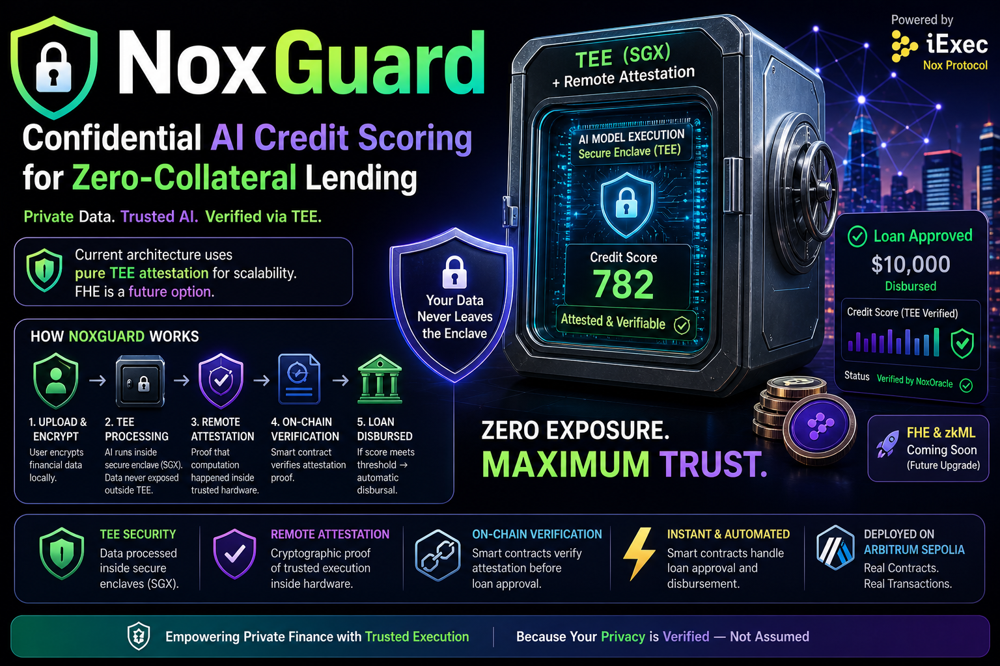

<div align="center">
  

  <h1>NoxGuard</h1>
  <p><strong>Institutional-Grade Confidential AI Credit Scoring & Zero-Collateral Lending</strong></p>
  <p><i>Empowering the Future of Private Finance via iExec Nox Protocol</i></p>
</div>

---

## Executive Summary
**NoxGuard** bridges the gap between traditional finance (TradFi) and decentralized finance (DeFi) by solving the industry's biggest bottleneck: **Financial Privacy**. 

Current Web3 lending protocols either require massive overcollateralization or force users to expose their highly sensitive financial history on a public ledger. NoxGuard utilizes the **iExec Nox Protocol** (Trusted Execution Environments) to enable autonomous, undercollateralized loans where neither the lender nor the blockchain ever sees the borrower's private data or exact credit score.

---

## 🔴 The Privacy Paradox (The Problem)
Undercollateralized lending is the holy grail of DeFi. However, the current approach requires users to expose their highly sensitive, private financial history (income, expenses, credit utilization) on a public blockchain. Institutions and retail users will never adopt Web3 lending if it means destroying their financial privacy and letting the whole world see their bank statements.

## 🟢 The NoxGuard Architecture (The Solution)
NoxGuard is an institutional-grade lending primitive that solves this by strictly shifting all confidential compute off-chain into the iExec TEE.

1. **The Vault (TEE):** A user uploads their private financial history. Instead of going to the blockchain, it is securely routed into an air-gapped, impenetrable Intel SGX Enclave.
2. **The Blind AI:** Inside the enclave, a deterministic ONNX machine learning model evaluates the financial data, calculates a credit score, and securely deletes the raw data. No external network calls are made.
3. **The Lockbox (Cryptographic Attestation):** The TEE securely checks the score against the lender's threshold. It then cryptographically signs a boolean approval payload using its private enclave key (MRSIGNER) and pushes it on-chain.
4. **The Magic Check:** The `NoxCreditGate` smart contract verifies the TEE's signature, securely dispensing the loan **without ever seeing or storing the encrypted score**.

---

## ⚙️ iExec Nox Protocol Integration
NoxGuard heavily leverages the **iExec Nox Protocol** to achieve end-to-end privacy and composability without relying on expensive on-chain FHE computation:

- **NoxOracle:** An on-chain verifier that authenticates the ECDSA signature generated by the TEE, verifying the `MRENCLAVE` measurement to ensure the AI model's code hasn't been tampered with.
- **NoxScoreRegistry:** A lightweight registry tracking TEE attestation states for users.
- **NoxCreditGate:** The state machine that manages lender access. It strictly verifies TEE EIP-712 signatures to autonomously disperse funds if criteria are met.

---

## 🛡️ Security Audit & Hardening
Following a professional security audit, the smart contract architecture was hardened against all known Web3 signature attack vectors:
- **Infinite Replay Protection:** Implemented strict on-chain nonces mapping (`mapping(address => uint256) nonces`) in the Credit Gate to prevent same-chain signature reuse.
- **Cross-Chain Replay Protection:** Implemented **EIP-712 Domain Separators**. All TEE signatures tightly encode the `block.chainid` and `address(this)`, completely neutralizing cross-contract and cross-chain replay vulnerabilities.
- **Collision Resistance:** Enforced strict padding using `abi.encode` instead of `abi.encodePacked` to prevent cryptographic hash collisions.

> **Security Roadmap (Post-Hackathon):**
> *Our current testnet implementation demonstrates the core TEE-to-Chain verification flow. For Mainnet production, we plan to decentralize the oracle key management via a DAO multi-sig and enforce a 48-hour timelock for administrative upgrades.*

---

## 🛠️ Repository Structure
This monorepo contains the complete, end-to-end infrastructure required to run NoxGuard:

```text
NoxGuard/
├── contracts/       # Smart contracts (NoxScoreToken, NoxOracle, NoxCreditGate)
├── iapp/            # TEE Enclave code (Node.js + ONNX AI Model) ready for iExec SCONE
├── sdk/             # Unified TypeScript SDK wrapping @iexec/dataprotector
├── frontend/        # Next.js UI built with Wagmi/RainbowKit for user interaction
└── docs/            # Architecture diagrams and assets
```

---

## 🚀 Quick Start (Local Development)

### Prerequisites
- Node.js v20+
- Hardhat
- MetaMask

### 1. Smart Contracts & Protocol Layer
```bash
npm install
npx hardhat test          # Run the full integration test suite
npx hardhat run scripts/deploy.ts --network arbitrumSepolia # Deploy infrastructure
```

### 2. Frontend Application
```bash
cd frontend
npm install
npm run dev
```
Open [http://localhost:3000](http://localhost:3000) to view the application.

### 3. TEE Machine Learning Model (Local Execution)
```bash
cd iapp
npm install
npx ts-node src/index.ts
```

---

## 🌐 Live Testnet Deployment (Arbitrum Sepolia)
The NoxGuard infrastructure is strictly compliant with the iExec TEE stack and is live on the Arbitrum Sepolia testnet:
- **NoxScoreToken:** `0xe9Bb632936610287a02ed74560fC4f2225233619`
- **NoxOracle:** `0x96aF746857D25603A4Ece7DB5AA0a2DC2a0Af254`
- **NoxCreditGate:** `0x2C5Ed44ec97a36c77890471E307F7aED74DaAD2A`

---
*Built for the iExec Vibe Coding Challenge 2026*
